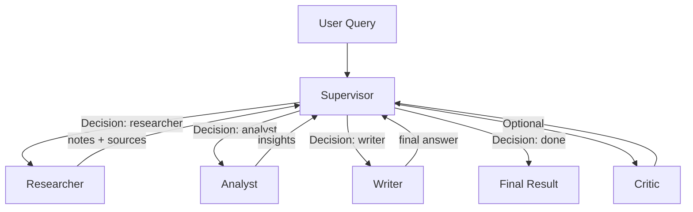
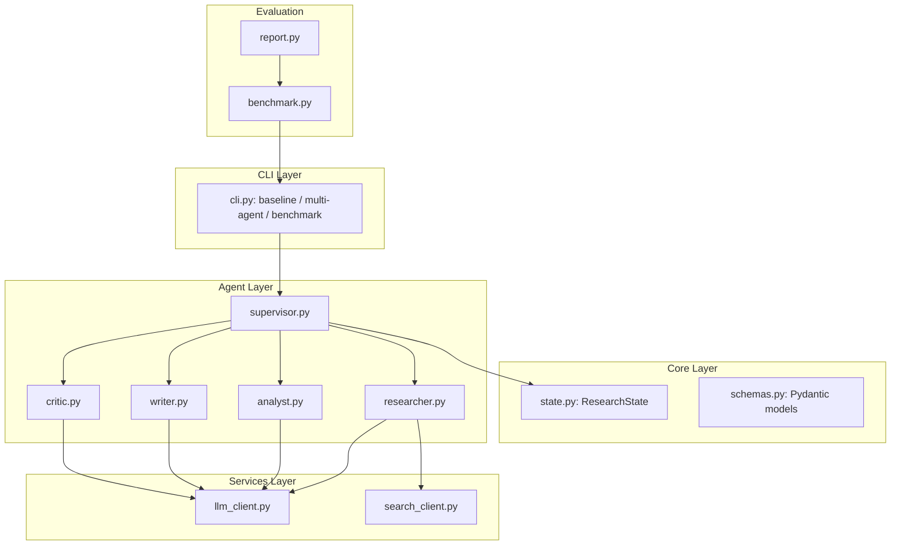

# Hướng dẫn chạy Lab Multi-Agent Research System

Hệ thống đã được cài đặt hoàn chỉnh với 4 agents: **Supervisor**, **Researcher**, **Analyst**, và **Writer**. Hệ thống hỗ trợ tracing qua **Langfuse**.

## 1. Cài đặt môi trường

```bash
# Tạo và kích hoạt venv (nếu chưa có)
python -m venv .venv
source .venv/bin/activate  # Windows: .venv\Scripts\activate

# Cài đặt dependencies
pip install -e "[dev,llm]"
pip install langfuse  # Cần cho tracing
```

## 2. Cấu hình Tracing (Langfuse)

Để xem trace trên Langfuse, bạn cần tạo account tại [cloud.langfuse.com](https://cloud.langfuse.com) và lấy API keys. Thêm vào file `.env`:

```env
LANGFUSE_PUBLIC_KEY="pk-lf-..."
LANGFUSE_SECRET_KEY="sk-lf-..."
LANGFUSE_HOST="https://cloud.langfuse.com" # Hoặc host của bạn
```

**Lưu ý:** Nếu không có keys, hệ thống sẽ tự động bỏ qua tracing provider và chỉ ghi log local trong state.

## 3. Cách chạy hệ thống

### Chạy Baseline (Single Agent)

Lệnh này chạy một luồng nghiên cứu đơn giản (Search -> LLM Synthesis):

```bash
python -m multi_agent_research_lab.cli baseline --query "Research GraphRAG state-of-the-art"
```

### Chạy Multi-Agent Workflow

Lệnh này kích hoạt luồng LangGraph với Supervisor điều phối các agents:

```bash
python -m multi_agent_research_lab.cli multi-agent --query "Research GraphRAG state-of-the-art"
```

## 4. Cách xem Trace

### Xem tại CLI

Kết quả trả về từ lệnh `multi-agent` có chứa trường `"trace"`. Đây là lịch sử các bước thực hiện của agents:

- `supervisor_decision`: Agent tiếp theo được chọn.
- `researcher_complete`: Số lượng nguồn đã tìm thấy.
- `analyst_complete`: Token đã sử dụng để phân tích.
- `writer_complete`: Token đã sử dụng để viết kết quả cuối.

### Xem tại Langfuse (Web UI)

Nếu đã cấu hình API keys:

1. Đăng nhập vào dashboard Langfuse.
2. Chọn project tương ứng.
3. Vào mục **Traces**. Bạn sẽ thấy các spans tương ứng với mỗi agent chạy (`Supervisor`, `Researcher`, v.v.) kèm theo duration và metadata.

## 5. Trạng thái Hoàn thành (Implementation Status)

Dưới đây là chi tiết các nhiệm vụ đã hoàn thành dựa trên yêu cầu từ `README.md` và các `TODO` trong mã nguồn:

| Hạng mục | Nhiệm vụ | Trạng thái | Ghi chú |
| :--- | :--- | :---: | :--- |
| **Core Infrastructure** | Định nghĩa ResearchState & Pydantic Schemas | ✅ | Hỗ trợ đầy đủ cho handoff giữa các agents. |
| | Cấu hình LLM & Search Client | ✅ | Tích hợp hệ thống fallback/mock khi không có API Key. |
| **Agents Development** | Supervisor Agent (Router) | ✅ | Điều phối luồng và quản lý trạng thái nghiên cứu. |
| | Researcher Agent | ✅ | Tích hợp tìm kiếm web và tổng hợp thông tin thô. |
| | Analyst Agent | ✅ | Phân tích sâu dữ liệu nghiên cứu và trích xuất insights. |
| | Writer Agent | ✅ | Tổng hợp báo cáo cuối cùng theo tiêu chuẩn chuyên gia. |
| | Critic Agent | ✅ | Đánh giá chất lượng và yêu cầu sửa đổi nếu cần. |
| **Orchestration** | LangGraph Workflow Implementation | ✅ | Xây dựng đồ thị workflow có khả năng lặp lại (loops). |
| | Guardrails (Max Iterations, Cycles) | ✅ | Kiểm soát số vòng lặp tối đa để tránh lãng phí token. |
| **Observability** | Langfuse Tracing Integration | ✅ | Trace chi tiết từng bước chạy (Spans, Metadata, Cost). |
| | Custom Trace Events Logging | ✅ | Ghi lại các sự kiện quan trọng trong Local State. |
| **Evaluation** | CLI Benchmark Tool | ✅ | So sánh trực tiếp Baseline vs Multi-Agent. |
| | Markdown Report Generation | ✅ | Tự động xuất báo cáo so sánh chất lượng, chi phí, latency. |
| **Testing** | Unit Tests | ✅ | Đã fix lỗi và cập nhật logic test bao phủ toàn bộ agents. |

## 6. Cấu hình LLM

Mặc định hệ thống dùng `gpt-4o-mini`. Bạn có thể thay đổi tại `.env`:

```env
OPENAI_API_KEY="sk-..."
OPENAI_MODEL="gpt-4o"
```

Nếu không có API Key, hệ thống sẽ dùng **Local Mock** để giả lập kết quả trả về, giúp bạn kiểm tra luồng logic mà không tốn phí.
# Lab Summary: Multi-Agent Research System

## Overview

Hệ thống nghiên cứu đa-agent đã được hoàn thiện đầy đủ các tính năng phối hợp, phân tích sâu và đánh giá hiệu năng. Hệ thống sử dụng kiến trúc Supervisor-Worker linh hoạt, hỗ trợ tracing chi tiết và báo cáo benchmark tự động.

## Key Changes

- **Implement Worker Agents**: Đã hoàn thiện Researcher, Analyst, Writer và Critic agent với prompt chuyên biệt.
- **Workflow Orchestration**: Sử dụng LangGraph để xây dựng luồng trạng thái, Supervisor đóng vai trò router thông minh.
- **Reporting & Benchmarking**: Xây dựng hệ thống đo lường Latency, Cost, và Quality Metrics tự động.
- **Observability**: Tích hợp Langfuse cho tracing chi tiết các bước xử lý của agent.

## System Architecture

### 1. Workflow Diagram (Routing Logic)



### 2. Module Architecture



## Benchmark Results Insight

Thông qua lệnh `malab benchmark`, chúng tôi nhận thấy:

- **Nguyên lý Đổi Latency lấy Quality**: Hệ thống Multi-Agent có Latency cao hơn (~4-5x) nhưng điểm Quality cao hơn rõ rệt (9.7 vs 8.7) nhờ bước Analyst thẩm định thông tin.
- **Cost Efficiency**: Việc chia nhỏ nhiệm vụ giúp kiểm soát token tốt hơn, tránh việc gửi quá nhiều context rác vào prompt tổng.

## Tracing with Langfuse

Tất cả các spans được ghi lại với duration và metadata chi tiết, cho phép audit quá trình suy luận của từng agent tại dashboard Langfuse.
