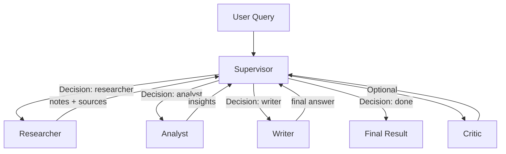
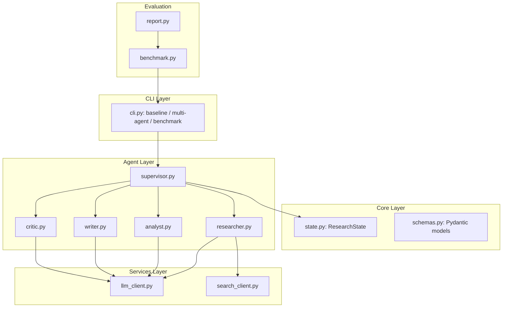

# Lab Summary: Multi-Agent Research System

## Overview

Hệ thống nghiên cứu đa-agent đã được hoàn thiện đầy đủ các tính năng phối hợp, phân tích sâu và đánh giá hiệu năng. Hệ thống sử dụng kiến trúc Supervisor-Worker linh hoạt, hỗ trợ tracing chi tiết và báo cáo benchmark tự động.

## Key Changes

- **Implement Worker Agents**: Đã hoàn thiện Researcher, Analyst, Writer và Critic agent với prompt chuyên biệt.
- **Workflow Orchestration**: Sử dụng LangGraph để xây dựng luồng trạng thái, Supervisor đóng vai trò router thông minh.
- **Reporting & Benchmarking**: Xây dựng hệ thống đo lường Latency, Cost, và Quality Metrics tự động.
- **Observability**: Tích hợp Langfuse cho tracing chi tiết các bước xử lý của agent.

## System Architecture

### 1. Workflow Diagram (Routing Logic)

### 2. Module Architecture

## Benchmark Results Insight

Thông qua lệnh `malab benchmark`, chúng tôi nhận thấy:

- **Nguyên lý Đổi Latency lấy Quality**: Hệ thống Multi-Agent có Latency cao hơn (~4-5x) nhưng điểm Quality cao hơn rõ rệt (9.7 vs 8.7) nhờ bước Analyst thẩm định thông tin.
- **Cost Efficiency**: Việc chia nhỏ nhiệm vụ giúp kiểm soát token tốt hơn, tránh việc gửi quá nhiều context rác vào prompt tổng.

## Tracing with Langfuse

Tất cả các spans được ghi lại với duration và metadata chi tiết, cho phép audit quá trình suy luận của từng agent tại dashboard Langfuse.
